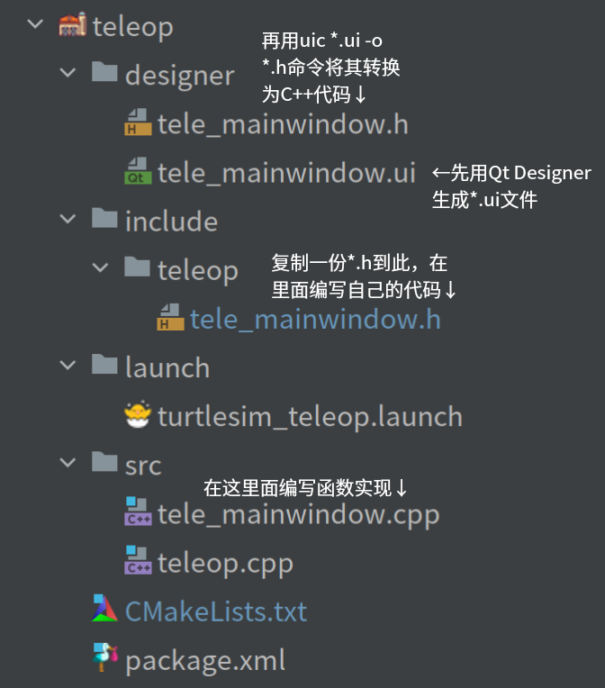

# Pipeline 流程

<div align=center></div>
<div align=center>pipeline 流程图</div>

1. Use `Qt Designer` to design the interface, simple signal and slot functions could be set in `Qt Designer`, then the generated `xxx.ui` should be put in `designer/`
2. Use the `uic xxx.ui -o xxx.h` command to convert it into C++ code
3. Copy the generated `xxx.h` code to `include/pkg_name/`, write the declaration part of your own code in `namespace Ui {class MainWindow {}}`, such as constructors, members, member functions, signal functions, slot functions, callback functions, and so on
4. Write the function implementation part of your own code in `src/xxx.cpp`
5. Compile and link in `CMakeLists.txt`:
   1. if the `namespace Ui {class MainWindow {}}` part in `include/pkg_name/xxx.h` does not contain macros `Q_OBJECT`, then the Qt section in `CMakeLists.txt` is
      ```cmake
      find_package(Qt5 REQUIRED COMPONENTS Core Widgets)
      
      set(${PROJECT_NAME}_node_SRCS src/main.cpp src/xxx.cpp)
      set(${PROJECT_NAME}_node_HDRS include/pkg_name/xxx.h)
      
      add_executable(${PROJECT_NAME}_node ${${PROJECT_NAME}_node_SRCS} ${${PROJECT_NAME}_node_HDRS})
      target_link_libraries(${PROJECT_NAME}_node ${catkin_LIBRARIES} Qt5::Core Qt5::Widgets)
      ```
   2. if the `namespace Ui {class MainWindow {}}` part in `include/pkg_name/xxx.h` does contain macros `Q_OBJECT`, then the Qt section in `CMakeLists.txt` is
      ```cmake
      find_package(Qt5 REQUIRED COMPONENTS Core Widgets)
      
      set(${PROJECT_NAME}_node_SRCS src/main.cpp src/xxx.cpp)
      set(${PROJECT_NAME}_node_HDRS include/pkg_name/xxx.h)
      
      qt5_wrap_cpp(${PROJECT_NAME}_node_MOCS ${${PROJECT_NAME}_node_HDRS})
      
      add_executable(${PROJECT_NAME}_node ${${PROJECT_NAME}_node_SRCS} ${${PROJECT_NAME}_node_MOCS})
      target_link_libraries(${PROJECT_NAME}_node ${catkin_LIBRARIES} Qt5::Core Qt5::Widgets)
      ```


1. 先用`Qt Designer`设计界面，可以在`Qt Designer`里设置简单的信号和槽函数，将保存生成的`xxx.ui`文件放在`designer/`中
2. 再用`uic xxx.ui -o xxx.h`命令将其转换为C++代码
3. 将生成的`xxx.h`代码复制到`include/pkg_name/`中，在`namespace Ui {class MainWindow {}}`里编写自己代码的声明部分，比如构造函数、成员、成员函数、信号函数、槽函数、回调函数等等
4. 在`src/xxx.cpp`里编写自己代码的函数实现部分
5. 在`CMakeLists.txt`里进行编译和链接：
   1. 如果`include/pkg_name/xxx.h`的`namespace Ui {class MainWindow {}}`不含宏`Q_OBJECT`，则有关Qt部分为
      ```cmake
      find_package(Qt5 REQUIRED COMPONENTS Core Widgets)
      
      set(${PROJECT_NAME}_node_SRCS src/main.cpp src/xxx.cpp)
      set(${PROJECT_NAME}_node_HDRS include/pkg_name/xxx.h)
      
      add_executable(${PROJECT_NAME}_node ${${PROJECT_NAME}_node_SRCS} ${${PROJECT_NAME}_node_HDRS})
      target_link_libraries(${PROJECT_NAME}_node ${catkin_LIBRARIES} Qt5::Core Qt5::Widgets)
      ```
   2. 如果`include/pkg_name/xxx.h`的`namespace Ui {class MainWindow {}}`含宏`Q_OBJECT`，则有关Qt部分为（参考`turtlesim/CMakeLists.txt`）
      ```cmake
      find_package(Qt5 REQUIRED COMPONENTS Core Widgets)
      
      set(${PROJECT_NAME}_node_SRCS src/main.cpp src/xxx.cpp)
      set(${PROJECT_NAME}_node_HDRS include/pkg_name/xxx.h)
      
      qt5_wrap_cpp(${PROJECT_NAME}_node_MOCS ${${PROJECT_NAME}_node_HDRS})
      
      add_executable(${PROJECT_NAME}_node ${${PROJECT_NAME}_node_SRCS} ${${PROJECT_NAME}_node_MOCS})
      target_link_libraries(${PROJECT_NAME}_node ${catkin_LIBRARIES} Qt5::Core Qt5::Widgets)
      ```
