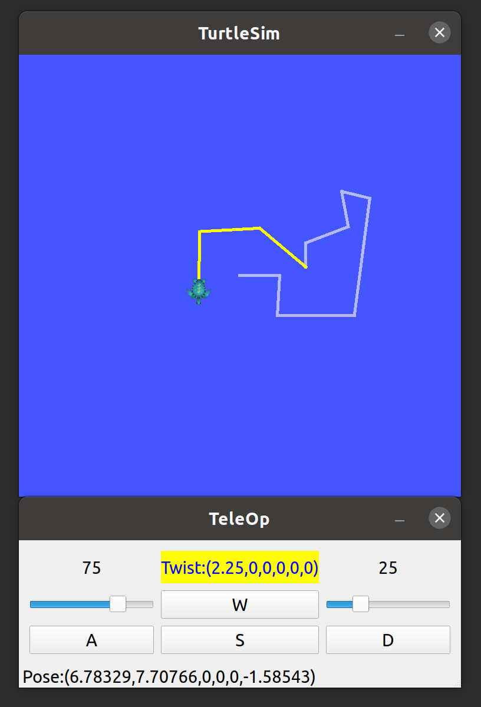
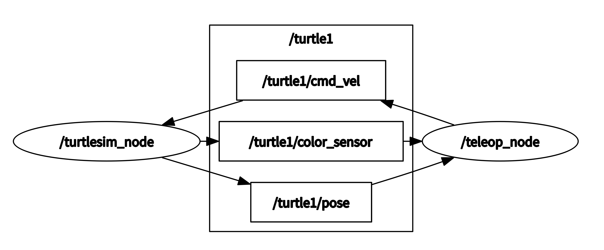

# Hello ROS Qt
<div align=center></div>
<div align=center>visualization 界面</div>

## Introduction 介绍

A ROS package based on C++ and Qt for ros-tutorial's turtle simulation teleoperation.

基于C++和Qt的ROS包，用于ROS教程-小乌龟仿真的界面遥控。

## Nodes graph 节点关系图

<div align=center></div>
<div align=center>nodes_rqt_graph 节点关系图</div>

## Prerequisite 所需软件库

- Ubuntu 20.04
- ROS Noetic
- Qt5: qt5-default, qt5-doc, qtbase5-dev, qtbase5-dev-tools, qtchooser

## Usage 用法

### 1. Build 构建

1. Install the prerequisites 安装所需软件库

2. Build a workspace 创建工作空间

   ```shell
   mkdir -p catkin_ws/src
   ```

3. Clone this repository in `/catkin_ws/src` 克隆仓库

   ```shell
   cd catkin_ws/src
   git clone https://github.com/McQueenZero/Hello-ROS-Qt.git
   ```

4. Build the files 编译

   ```shell
   catkin_make
   ```
   
### 2. Run 运行

1. Launch the nodes 启动节点

   ```shell
   cd catkin_ws
   source devel/setup.bash
   roslaunch teleop turtlesim_teleop.launch
   ```

2. Change the turtle path pen color 更改乌龟轨迹笔刷颜色

   ```shell
   rosservice call /turtle1/set_pen "{r: 0, g: 0, b: 0, width: 5, 'off': 0}"
   ```

## Reference

- [ros_tutorials/turtlesim](https://github.com/ros/ros_tutorials/tree/noetic-devel/turtlesim)
- [Qt Widgets Examples](https://doc.qt.io/qt-5/examples-widgets.html)
- [Qt Widgets C++ Classes](https://doc.qt.io/qt-5/qtwidgets-module.html)
